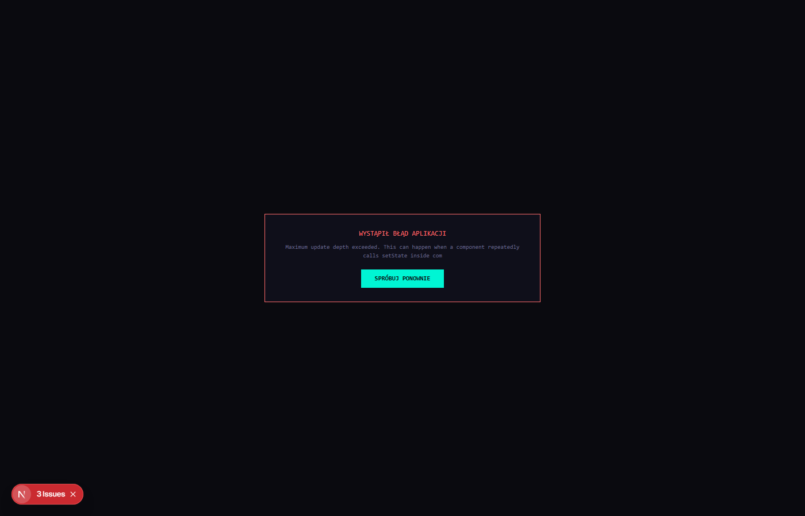

<p align="center">
  
</p>

<h1 align="center">BOKA OS</h1>

<p align="center">
  <strong>AI-powered home assistant that lives in your browser</strong><br>
  Voice chat, family memory, multi-agent debate, camera monitoring, and app management
</p>

<p align="center">
  <a href="https://img.shields.io/badge/Node.js-18+-339933?logo=node.js&logoColor=white"></a>
  <a href="https://img.shields.io/badge/Next.js-16-black?logo=next.js"></a>
  <a href="https://img.shields.io/badge/TypeScript-5-blue?logo=typescript"></a>
  <a href="LICENSE"></a>
</p>

---

## Screenshots

### Main Dashboard


### Family Profiles


### Settings


### Skills


### Chat View


## Features

| Category | What it does |
|----------|-------------|
| **Voice Chat** | STT (Web Speech API / Whisper) + TTS (Edge TTS / browser) — talk to BOKA naturally |
| **Memory** | Multi-layered: memory entries, relationship graph, Vault (Obsidian-style notes) |
| **Debate** | BOKA splits into 6 agent-personalities that debate before answering |
| **Family** | Member profiles with photos, preferences, zodiac signs, expenses, budgets |
| **Vision** | Camera monitoring (webcam + IP), scene analysis via VLM |
| **Skills** | AI frameworks: Qdrant, Mem0, GraphRAG, DeepAgents, AutoGen, CrewAI, OpenHands |
| **Orb BOKA** | 4 visual styles: Plasma, Water, Obsidian (memory graph), Formula (math patterns) |
| **Privacy** | Audit log, Forget API, family consent management |
| **MCP & CLI** | MCP servers, terminal, Higgsfield integration |
| **Apps** | Launch mini-apps (Go, Python, HTML, JS) from the dashboard |
| **Auth** | Optional password login (Edge middleware) |

## LLM Providers

| Provider | API Key | Notes |
|----------|---------|-------|

| OpenRouter | Yes | Any model via OpenRouter |
| Ollama | No | Local models (localhost:11434) |
| GGUF | No | .gguf file via llama.cpp |
| Custom | Varies | Any OpenAI-compatible server |

## Quick Start

### Prerequisites

- **Node.js 18+** or **Bun**
- Browser with Web Speech API (Chrome/Edge recommended)

### Install

```bash
git clone https://github.com/limtzugar/boka.git
cd boka
npm install
```

### Setup

```bash
# Generate Prisma client
npx prisma generate

# Create database
npx prisma db push

# Copy config
cp .env.example .env

# (Optional) Enable auth — uncomment BOKA_ACCESS_PASSWORD in .env
```

### Run

```bash
npm run dev
```

Open `http://localhost:3000`

## Architecture

```
BOKA OS/
├── src/
│   ├── app/
│   │   ├── api/           # 15+ API routes (agents, memory, TTS, vision, apps)
│   │   ├── widget/        # Standalone widget mode
│   │   └── page.tsx       # Main dashboard
│   ├── components/        # UI: debate, memory graph, MCP, file explorer, privacy
│   ├── lib/
│   │   ├── agent-system.ts       # 6-agent personality system
│   │   ├── agent-memory/         # Multi-layered memory (entries, graph, vault)
│   │   ├── ai-providers.ts       # LLM provider abstraction
│   │   ├── autogen-service.ts    # AutoGen integration
│   │   ├── crewai-service.ts     # CrewAI integration
│   │   ├── deepagents-service.ts # DeepAgents integration
│   │   ├── apps-manager.ts       # Mini-app launcher
│   │   ├── audit-service.ts      # Privacy audit log
│   │   └── desktop-agent.ts      # Desktop automation
│   ├── hooks/             # React hooks
│   └── middleware.ts      # Auth middleware
├── prisma/
│   └── schema.prisma      # Family, Members, Memory, Conversations, Expenses, Budgets
├── public/                # Static assets
└── scripts/               # Setup scripts
```

## Tech Stack

| Layer | Technology |
|-------|-----------|
| GUI | Next.js 16, React 19, Tailwind CSS 4, shadcn/ui |
| Database | Prisma 6, SQLite |
| AI | OpenRouter, Ollama, AutoGen, CrewAI, DeepAgents |
| Voice | Web Speech API, Edge TTS, Whisper |
| Memory | Qdrant, Mem0, GraphRAG |
| Privacy | Audit log, Forget API, consent management |

## Privacy First

- All data stored locally in SQLite
- Audit log tracks every AI interaction
- Forget API allows full data deletion
- Family consent required for new members
- Optional password authentication

## License

[MIT](LICENSE)
